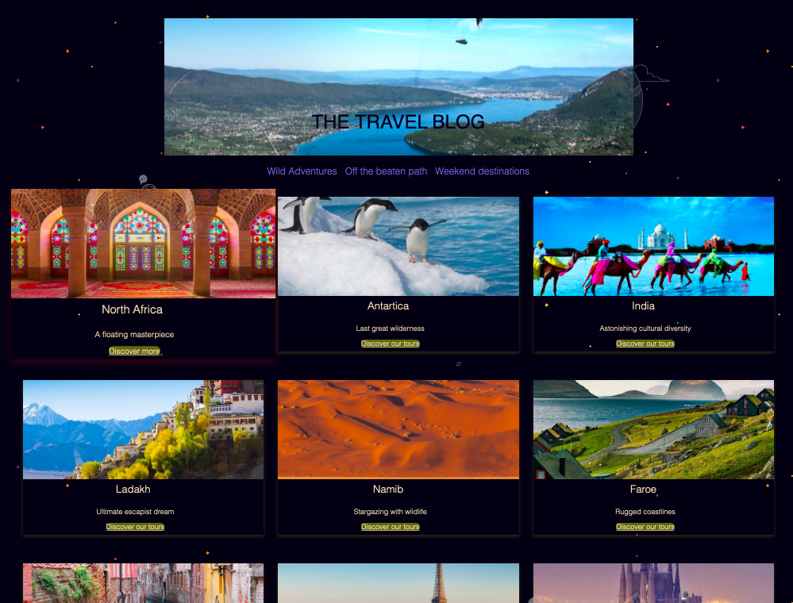

# Front End Nanodegree Program

Front End Nanodegree Project Resources for Personal blog:
https://review.udacity.com/#!/rubrics/2667/view

Project to complete component 1: CSS, Website Layout, Website Components
In this project, code is written across a handful of HTML and CSS files.

## Folders guide

All files requied to display index.html and blogpost.html are found here

1. css: styling sheets for homepage and blogpost
2. images: all images used for the project 
3. index.html: Home page
4. blogpost.html: example blogpost linked to the homepage
(click on Discover our tours)

## Contributors

All code is original and written by Soumya Krishnamurthy.
There are no other contributors

## Future projects

- Landing Page
- Weather Journal App
- Evaluate A News Article with Natural Language Processing
- Capstone

## Udacity style guides used throughout the nanodegree program

[HTML and CSS](http://udacity.github.io/frontend-nanodegree-styleguide/index.html)

## Screenshot

